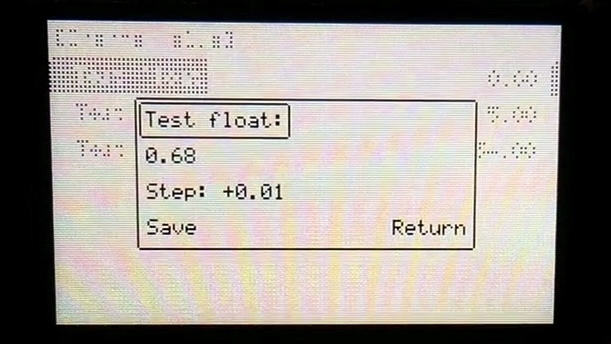
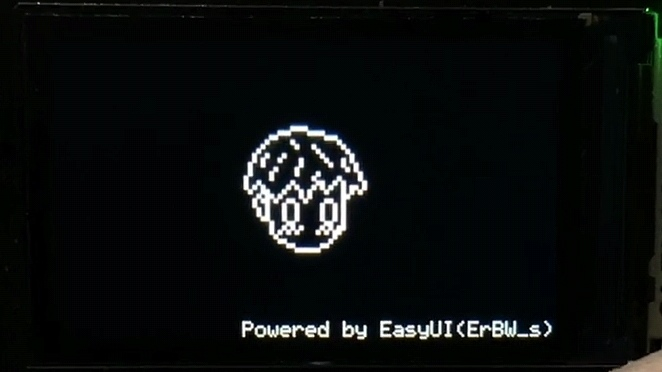
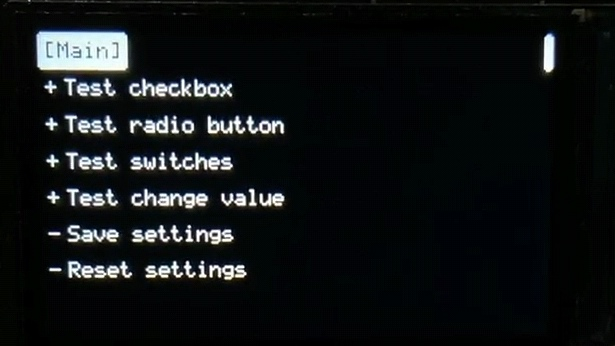
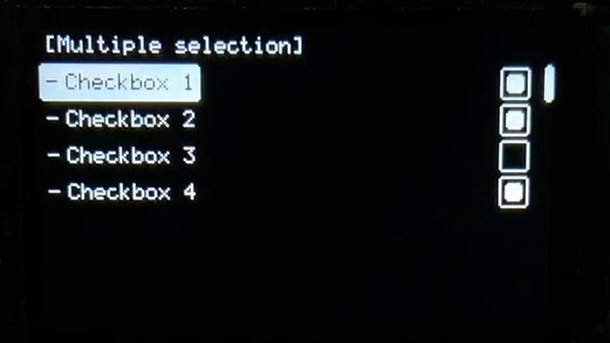
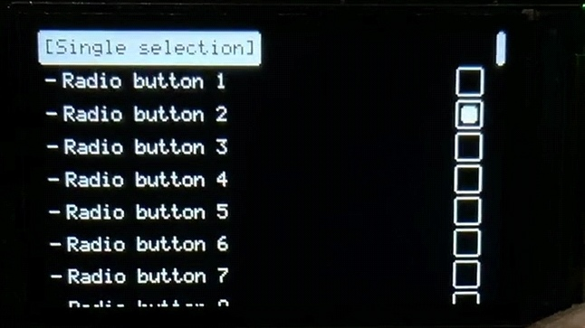
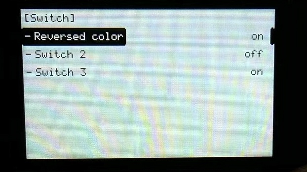
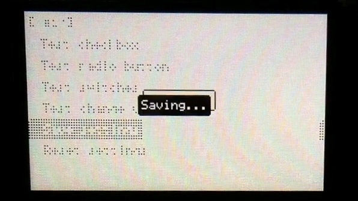

# Easy-UI

基于魔改的逐飞屏幕驱动，拙劣地模仿了稚晖君的[MonoUI](https://www.youtube.com/watch?v=44RmDMXcU9s&ab_channel=%E7%A8%9A%E6%99%96%E5%90%9B)实现方式，参考了createskyblue的[OpenT12](https://gitee.com/createskyblue/OpenT12)项目UI所编写的一个UI。

## 样例

[点这里](./3.Example/menu.c)

## 实现方式浅析

### 框架实现

菜单页面、项目、按键实现均采用**链表**方式，理论可无限扩展；

`AddItem` / `AddPage` 采用**可变参数函数**实现，实现输入不同`func`时获取不同的后续参数以初始化菜单。

### 屏幕驱动魔改 / 掉电存储

在逐飞的IPS114屏幕驱动基础上增加**缓冲区**，删除断言函数改为`break`处理；

参照`u8g2`增加部分显示函数，如`绘制圆角方框`等；

增加可设置颜色模式，支持正常与异或绘制，用以绘制反色指示器等；

每次系统初始化时判断`flash`内相应区域是否为空，若非空则读取一次数据。

> ‼️每次增减菜单结构请先**擦除全片**再进行烧录
>
> 此部分仅部分开源，完整代码后续会在工程项目中开源

## 相对MonoUI的一些更改

### 进度条

为了实现变量值修改时可**更改步长**，适配不同数量按键时统一的一套**保存/放弃修改**操作，我放弃了进度条的实现，更改后界面如下：

### 导航条

导航条原来是显示该页面所具有的**栏目数量及当前所在栏目**，但若**栏目众多**或**屏幕像素高度 / 栏目数量**的结果不为整数时出来的效果我感觉不尽如人意，因此我将其更改为与反色指示器具有相同的位置计算，仅显示**当前屏幕上指示器所在位置**，也在一定程度上方便了在宽屏上，使用者一一对应左侧标题右侧状态的难易度。

## 部分菜单界面一览

### 初始界面

### 主界面

### 多选框界面

### 单选框界面（同一时刻只有一个能被选中）

### 开关界面

### 消息框绘制

